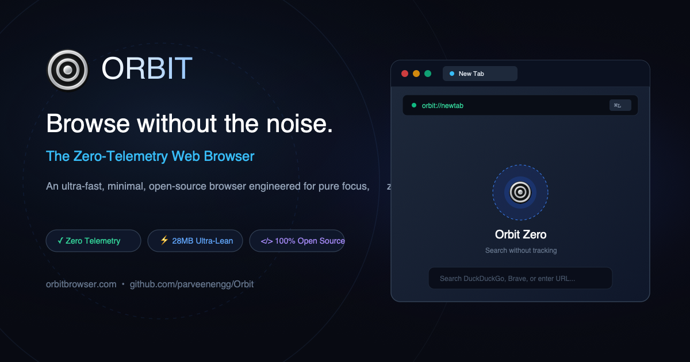

<div align="center">

  

  <br />
  <br />

  # Orbit — The Zero-Telemetry Web Browser
  
  **Browse without the noise.**  
  *A minimal, privacy-focused open-source web browser engineered for pure focus, native speed, zero developer tracking, and complete user agency.*

  <br />

  [](LICENSE)
  [-10b981.svg?style=for-the-badge&logo=android&logoColor=white)](downloads/Orbit.apk)
  [](pages/privacy.html)
  [](pages/download.html)
  [](https://github.com/parveenengg/Orbit/pulls)

  <br />

  [**Explore Features**](https://orbitbrowser.com/features) • [**Download APK**](https://orbitbrowser.com/downloads/Orbit.apk) • [**Privacy Architecture**](https://orbitbrowser.com/privacy) • [**Manifesto**](https://orbitbrowser.com/manifesto) • [**Terms**](https://orbitbrowser.com/terms)

</div>

---

## ⚡ Core Philosophy & Pillars

Modern browsers have drifted away from being neutral windows into the internet. They have become bloated platforms for surveillance advertising, cryptocurrency wallets, and sponsored content. **Orbit strips all of that away.**

```
       ┌─────────────────────────────────────────────────────────────┐
       │                 THE ORBIT PRIVACY BOUNDARY                  │
       ├──────────────────────────────┬──────────────────────────────┤
       │   INSIDE ORBIT (LOCAL)       │   EXTERNAL WEB (REMOTE)      │
       │                              │                              │
       │   🔒 Zero telemetry & pings   │   🌐 Chosen search provider  │
       │   🔒 Sandboxed history       │   🌐 Websites you visit      │
       │   🔒 Local bookmarks         │   🌐 Direct HTTPS requests   │
       │   🔒 Local autofill cache    │   🌐 Standard site cookies   │
       │   🔒 No user profiling       │                              │
       └──────────────────────────────┴──────────────────────────────┘
```

1. **Zero Developer-Side Telemetry**  
   No analytics SDKs, no behavioral tracking, no identifier beacons, and no crash report phoning home. Your browsing activity stays strictly between you and your device.
2. **Search Engine Independence**  
   Pick your search engine with zero corporate bias: DuckDuckGo, Brave Search, Startpage, Google, Bing, or a custom search URL. Keystroke lookups remain offline in local cache.
3. **Ultra-Lean Native Architecture**  
   A compact 28MB native Android package engineered for instant startup, sub-millisecond tab switching, and minimal battery impact.
4. **Distraction-Free Visual Interface**  
   A serene desktop & mobile experience with visual tab cards, ergonomic omnibar controls, and clean light/dark appearance modes.
5. **No Gimmicks, No Crypto, No Ads**  
   Zero unsolicited AI sidebars, zero crypto wallets, zero sponsored background wallpapers, and zero news aggregator clickbait.

---

## 📊 Comparison Matrix

| Feature / Philosophy | Orbit | Chrome | Brave | Arc |
| :--- | :---: | :---: | :---: | :---: |
| **Developer Telemetry** | **Zero (0%)** | Comprehensive | Telemetry + Pings | Telemetry + Sync |
| **Search Engine Choice** | **100% Unbiased** | Google biased | Custom | Custom |
| **Crypto Wallets / Tokens** | **None** | None | Built-in Rewards | None |
| **Memory Footprint** | **Ultra-Lean (28MB)** | Heavy | Moderate | Heavy |
| **Open Source** | **100% Public** | Partial (Chromium) | Public | Proprietary |
| **Sponsored Content** | **None** | Sponsored ads | Sponsored cards | None |
| **Local-First Sandbox** | **Yes** | Cloud sync | Cloud sync | Cloud sync |

---

## 📦 Downloads & Verification

| Platform | Format | Release Status | Download Link |
| :--- | :--- | :--- | :--- |
| **Android** | `.apk` (v1.0.1) | **Available Now** | [Download Orbit.apk (28MB)](downloads/Orbit.apk) |
| **Google Play** | Play Store | *Under Policy Review* | Coming Soon |
| **macOS** | `.dmg` (Universal) | *Beta Development* | Universal Apple Silicon & Intel |
| **Linux & Windows** | Native packages | *Roadmap* | [Request Build Notification](pages/about.html) |

### 🔐 Cryptographic Checksum
To verify the integrity of the downloaded `Orbit.apk`:

```bash
shasum -a 256 downloads/Orbit.apk
```

**Expected SHA-256 Checksum:**
```text
932e81871003b12ccda0f6c17f5816a1bcaf13482fda6273d187c08dcf748bb4
```

---

## 🏗️ Repository Architecture

The repository is organized following clean web standards:

```text
Orbit/
├── index.html                   # High-performance 3D visual landing page
├── 404.html                     # Custom cosmic 404 error page
├── site.webmanifest             # PWA web manifest & mobile app definition
├── robots.txt                   # Search crawler directives
├── sitemap.xml                  # XML sitemap with canonical page priorities
├── favicon.ico                  # Multi-resolution optimized favicon
├── vercel.json                  # HSTS, security headers, caching & clean rewrites
├── README.md                    # Project documentation & visual guide
│
├── pages/                       # Clean URL editorial & product pages
│   ├── about.html               # Project philosophy, maker profile & feedback form
│   ├── features.html            # Interactive mobile & desktop feature tour
│   ├── download.html            # Release hub, direct APK & verified checksums
│   ├── opensource.html          # Public code guides, issue templates & contributing
│   ├── manifesto.html           # The Orbit Manifesto: Restoring Agency to the Web
│   ├── privacy.html             # Zero-telemetry policy & privacy boundary guide
│   ├── terms.html               # Terms of service, acceptable use & open-source license
│   └── documentation.html       # Cryptographic verification & legal documentation
│
├── css/                         # Modular CSS stylesheets
│   ├── styles.css               # Core design tokens, typography & base layout
│   ├── orbit-ui.css             # Shared navigation, buttons, cookie banner & contrast
│   ├── home-page.css            # Landing page desktop simulator & benefit cards
│   ├── features-tour.css        # Interactive tab tour layout & device mockups
│   ├── download-page.css        # Platform releases & hardware enclosure styles
│   └── orbit-pages.css          # Editorial typography & responsive grid system
│
├── js/                          # Modular client-side scripts
│   ├── app.js                   # Application lifecycle & interactive transitions
│   ├── three-scene.js           # 3D cosmic background WebGL canvas
│   ├── orbit-ui.js              # Cookie consent, HTTPS enforcement, validation & analytics
│   ├── home-page.js             # Hero simulator & card reveal handlers
│   ├── features-tour.js         # Mobile feature carousel & tab switcher
│   └── orbit-pages.js           # Editorial chapter animations
│
├── assets/                      # Media assets & graphics
│   ├── icons/                   # Favicon suite, brand emblems & vector graphics
│   ├── images/                  # Mockup screenshots, portrait photos & social cards
│   └── orbit-mac-interface.png  # Desktop browser window mockup
│
├── downloads/                   # Cryptographically signed release binaries
│   └── Orbit.apk                # Android v1.0.1 installation package
│
├── vendor/                      # Vendored external dependencies (GSAP, Three.js)
└── scripts/                     # Local development tooling & server scripts
    └── serve.py                 # Python dev server with clean route rewrites
```

---

## 🚀 Running the Landing Page Locally

You can spin up the landing page locally with clean URL rewrites matching Vercel's routing:

```bash
# Clone the repository
git clone git@github.com:parveenengg/Orbit.git
cd Orbit

# Start the local development server
python3 scripts/serve.py

# Open in your browser
http://localhost:8000
```

---

## 🛡️ Security, Privacy & Compliance

- **Zero Data Collection**: No cookies, no session IDs, no ad trackers, no server logs containing personal identifiers.
- **Strict HTTPS Enforcement**: HSTS (`max-age=63072000; includeSubDomains; preload`), `nosniff`, `SAMEORIGIN`, and strict referrer policies configured.
- **DNT / GPC Adherence**: Honors `navigator.doNotTrack` and `navigator.globalPrivacyControl` out of the box.
- **Honeypot Spam Protection**: Feedback and contact forms feature client-side rate-limiting and invisible bot-traps.
- **WCAG AA Contrast**: Engineered with accessible contrast ratios (>4.5:1) across both dark and light theme modes.

---

## 🤝 Contributing

We welcome community feedback, reproducible bug reports, and thoughtful pull requests:

1. **Explore Existing Issues**: Check [GitHub Issues](https://github.com/parveenengg/Orbit/issues) before opening a new ticket.
2. **Fork the Repo**: Create a feature branch (`git checkout -b feature/my-feature`).
3. **Commit Your Changes**: Follow clear, conventional commit messages.
4. **Push & Open a PR**: Submit a pull request to `main` with before/after screenshots for visual changes.

---

## 👤 Author & Maintainer

**Parveen Kumar**  
- GitHub: [@parveenengg](https://github.com/parveenengg)  
- Project Repository: [parveenengg/Orbit](https://github.com/parveenengg/Orbit)

---

## 📄 License

Orbit is licensed under the [MIT License](pages/terms.html#license) — free and open source for personal and commercial use.
